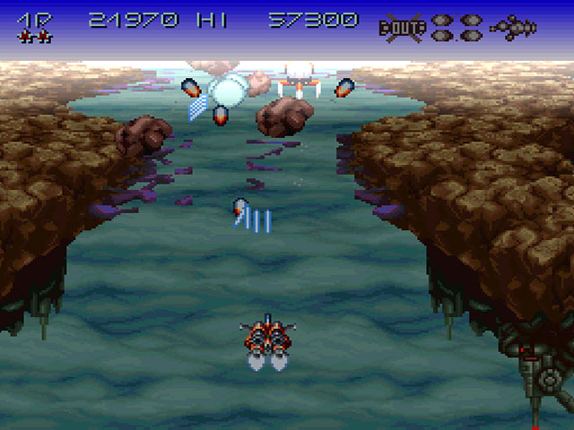

# Space Shooter Game

## Description

My latest project that will become a Space Shooter inspired by SNES games of the same genre such as Axelay, Gradius III and R-Type III.

I'm currently implementing the base of the project including Managers(game, audio, pool...), Resources and Settings, utility classess, movement and combat, sriptable objects etc.

## Work In Progress Features

- 3 playable ship types
- Upgrade system
- Combat system
- 3 levels with similar enemy AIs, different designs
- 6 enemy types + 3 boss fights

## Authors

[@necrocultist.itch.io](https://necrocultist.itch.io)

## Reference Screenshots From Arcade Games

Axelay

## Used Assets

Void Asset Pack by [FoozleCC](https://foozlecc.itch.io)
